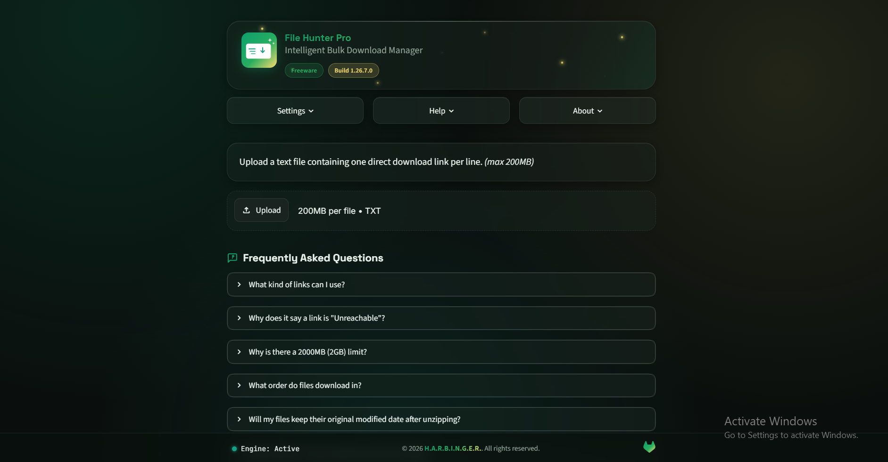
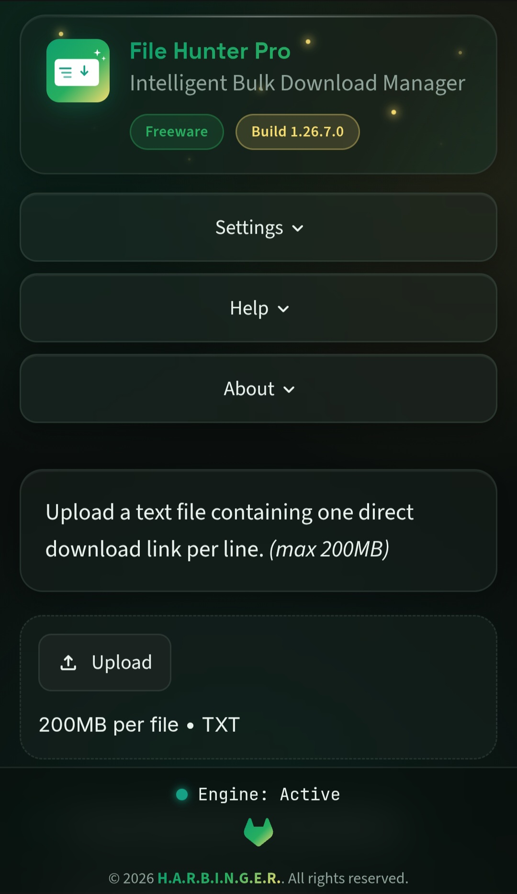

<div align="center">


# 🚀 File Hunter Pro

**Intelligent Bulk Download Manager**

⚡ Fast • 🧠 Intelligent • 🛡️ Reliable • 📦 Efficient

[](https://streamlit.io)
[](https://www.python.org)
[](LICENSE)
[](#)

*A modern bulk download manager built for speed, reliability, and simplicity.*

</div>

---

## Table of Contents

- [Overview](#overview)
- [Key Features](#key-features)
- [How It Works](#how-it-works)
- [Input Format](#input-format)
- [Getting Started](#getting-started)
- [Project Structure](#project-structure)
- [Requirements](#requirements)
- [Safe Download Limits](#safe-download-limits)
- [Privacy](#privacy)
- [Roadmap](#roadmap)
- [Contributing](#contributing)
- [Bug Reports](#bug-reports)
- [License](#license)
- [Developer](#developer)

---

## 📖 Overview

**File Hunter Pro** is a bulk file download manager built with **Python** and **Streamlit**.

Instead of downloading files one by one, simply prepare a text file containing direct download links. File Hunter Pro analyzes every link, validates availability, estimates download size, preserves original timestamps, downloads reachable files in chronological order, and packages everything into a single ZIP archive.

Useful for archiving research data, media collections, firmware packages, or any other batch of direct-download links.

---

## 🖼️ Screenshots

### 💻 Desktop


### 📱 Mobile


---

## ✨ Key Features

### 🔍 Intelligent Link Analysis
Every URL is checked before anything downloads — reachability, file size, filename, and Last-Modified timestamp — so you know exactly what you're getting.

### 📦 Bulk Download Engine
Upload a `.txt` file containing direct download URLs, and every reachable file is downloaded automatically with minimal user interaction.

### 📁 Smart ZIP Packaging
Files are streamed directly into the ZIP archive during download, eliminating temporary duplicate files, reducing disk usage, and improving packaging efficiency.

### 🕒 Original Last-Modified Preservation
When the source server provides one, each file's original **Last-Modified** date is preserved inside the ZIP.

### 📊 Live Progress Dashboard
Real-time overall progress, currently downloading file, download speed, ETA, downloaded size, and a live activity log.

### 📈 Download Summary
See total links, reachable files, unreachable files, and total size before you commit to downloading.

### 🎨 Modern Glassmorphism UI
A dark, glass-panel interface with smooth animations and a responsive, mobile-friendly layout.

### 🛑 Safe Download Limits
Configurable upload and package-size caps to keep memory and storage use predictable.

### ⚙️ Session Management
Each session is isolated with a unique session ID, confirmation dialogs, reset controls, and download confirmation before saving.

---

## ⚙️ How It Works

```
Prepare URL List → Upload TXT File → Analyze Every Link → Review Summary
        → Download Reachable Files → Package into ZIP → Confirm Download → Download ZIP
```

1. **Upload** a `.txt` file containing one direct download URL per line.
2. **Analyze** — each link is checked for reachability, size, and Last-Modified date.
3. **Review** — only valid, reachable files proceed to download.
4. **Download** — files are fetched oldest-first and streamed into a ZIP.
5. **Confirm & Save** — review the package, then save `fhp_downloads.zip` to your device.

---

## 📄 Input Format

A plain text file with **one direct download URL per line**:

```text
https://example.com/file1.iso
https://example.com/file2.pdf
https://example.com/file3.zip
```

- Lines starting with `#` are treated as comments and ignored.
- Blank lines are ignored.

---

## 🚀 Getting Started

### Clone the repository

```bash
git clone https://github.com/theharbingerhq/filehunter-pro.git
cd filehunter-pro
```

### Install dependencies

```bash
pip install -r requirements.txt
```

### Run the app

```bash
streamlit run FileHunter_Pro_1.26.7.0.py
```

Then open your browser at:

```
http://localhost:8501
```

### Deployment

File Hunter Pro can be hosted on Windows, Linux, macOS, Streamlit Community Cloud, Docker, a VPS, or a home server.

---

## 📁 Project Structure

```text
FileHunterPro/
│
├── FileHunter_Pro_1.26.7.0.py
├── assets
│    ├── app_logo.ico
│    ├── app_logo.svg
│    └── git_logo.svg
├── config/
│    └── app_config.ini
├── themes/
│    └── app_theme.css
├── screenshots/
├── LICENSE
├── README.md
└── requirements.txt
```

---

## 📋 Requirements

- Python 3.10+
- Streamlit
- Requests

---

## 🛡️ Safe Download Limits

To prevent excessive memory or storage usage, File Hunter Pro enforces configurable safeguards:

| Limit                  | Default (Configurable) |
|------------------------|------------------------|
| Upload file size       | 200 MB                 |
| Download package size  | ~2 GB                  |

---

## 🔒 Privacy

File Hunter Pro:

- Does not upload your files anywhere.
- Downloads directly from the original source.
- Requires no user account.
- Collects no analytics.

Your data stays under your control.

---

## 🛣️ Roadmap

### ✅ Completed

- [x] 🔍 Intelligent Link Analysis
- [x] 📦 Bulk File Downloads
- [x] 📁 Smart ZIP Packaging
- [x] 🕒 Original Last-Modified Timestamp Preservation
- [x] 📊 Live Progress Dashboard
- [x] 📈 Download Summary
- [x] ⚙️ Session Management
- [x] ✅ Download Confirmation Dialog
- [x] 🛡️ Configurable Upload & Package Size Limits
- [x] 📱 Mobile & Tablet Responsive UI

### 🚀 Planned

- [ ] ⏯️ Resumable Downloads
- [ ] ⚡ Multi-threaded Downloads
- [ ] 🔐 Authentication Support
- [ ] 🗂️ Download History
- [ ] 🔄 Retry Engine
- [ ] 🧹 File Filtering
- [ ] 🧬 Duplicate File Detection
- [ ] 📊 Statistics Dashboard

---

## 🤝 Contributing

Contributions are welcome. Ideas, bug reports, pull requests, feature suggestions, and UI improvements are all appreciated.

---

## 🐞 Bug Reports

Found a bug or unexpected behavior? Please open a GitHub Issue including:

- Steps to reproduce
- Expected behavior
- Actual behavior
- Screenshots (if applicable)

---

## 📜 License

Licensed under the [Apache License 2.0](LICENSE).

---

## 👨‍💻 Developer

### H.A.R.B.I.N.G.E.R.

**Hyper‑Advanced Research Bureau for Innovation, Networking, Global Engineering & Robotics**

<div align="center">

---

### ⭐ If you find File Hunter Pro useful, give the repo a star

It helps the project grow and motivates future development.

**Made with ❤️ using Python, Streamlit & Claude AI**

**© 2026 H.A.R.B.I.N.G.E.R.**
</div>
